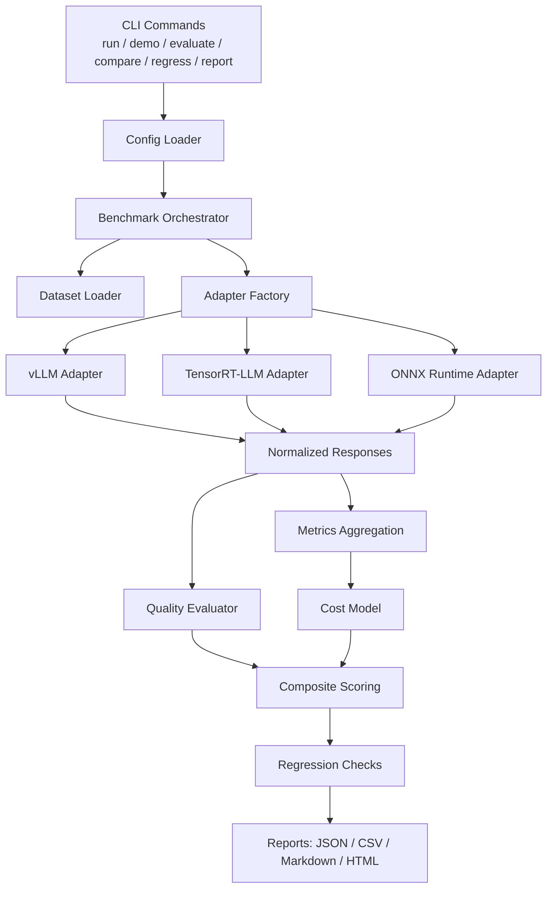

# LLM Evaluation & Benchmarking Suite

Reusable benchmarking and evaluation framework for comparing `vLLM`, `TensorRT-LLM`, and `ONNX Runtime / ORT GenAI` across answer quality, latency, throughput, resource utilization, and estimated serving cost.

The repository is designed to be useful in two modes:

- `mock/demo mode`: runs locally without requiring GPU infrastructure or real inference servers
- `real mode`: plugs into environment-specific serving endpoints, commands, or benchmark scripts

This makes the suite usable by ML engineers validating model behavior, platform engineers wiring serving infrastructure, and performance engineers tracking regressions over time.

## Why This Exists

Backend decisions are trade-off decisions. The fastest serving stack can produce worse outputs. The cheapest stack can increase latency tails. A quantization or scheduler change can improve throughput while hurting TTFT or reliability. This project gives teams a common harness to answer those questions consistently and to catch regressions automatically.

## What The Suite Does

- runs the same prompt corpora against multiple serving backends
- normalizes serving metrics into a common schema
- evaluates output quality against references and golden expectations
- estimates serving cost from configurable infrastructure assumptions
- compares current runs against prior baselines
- generates JSON, CSV, Markdown, and HTML artifacts
- produces a ranking based on a configurable composite score

## Supported Backends

- `vLLM`
- `TensorRT-LLM`
- `ONNX Runtime / ORT GenAI`

## Core Capabilities

- unified adapter abstraction with a shared backend contract
- deterministic mock responses for local development and CI smoke tests
- real-backend scaffolding for HTTP, CLI, and script-based integrations
- evaluation metrics including exact match, token F1, BLEU, ROUGE-L, pass rate, and golden checks
- cost modeling for cost per request, cost per million tokens, and cost-adjusted quality
- regression rules for latency, TTFT, throughput, cost growth, accuracy floor, and error rate
- profile-driven reproducibility with YAML configs
- report generation for both humans and CI/CD systems

## Architecture Diagram



## Benchmark Workflow

1. Load a run profile from `configs/profiles/*.yaml`.
2. Load one or more datasets from `jsonl`.
3. Instantiate each requested backend adapter.
4. Start or validate backend availability.
5. Execute requests and collect normalized per-request outputs.
6. Aggregate latency, throughput, token, and utilization metrics.
7. Run answer-quality evaluation against references.
8. Compute cost metrics from the configured cost profile.
9. Optionally compare results against a saved baseline.
10. Generate machine-readable and human-readable reports.

## Repository Structure

```text
llm_suite/
|-- .devcontainer/
|-- .github/workflows/
|-- artifacts/
|   `-- sample_run/
|-- configs/
|   |-- backends/
|   |-- costs/
|   |-- profiles/
|   `-- thresholds/
|-- data/
|   |-- golden/
|   `-- sample/
|-- docker/
|-- reports/
|-- scripts/
|-- src/llm_benchmark_suite/
|   |-- adapters/
|   |-- cost/
|   |-- evaluators/
|   |-- metrics/
|   |-- orchestration/
|   |-- regressions/
|   |-- reports/
|   |-- schemas/
|   `-- utils/
|-- tests/
|-- Dockerfile
|-- Makefile
|-- pyproject.toml
`-- README.md
```

## Repository Walkthrough

### `src/llm_benchmark_suite/`

Primary application code.

- `cli.py`: top-level command-line interface
- `config.py`: YAML config loading and normalization
- `logging_utils.py`: structured and console logging setup
- `schemas/models.py`: Pydantic models for requests, responses, metrics, and summaries
- `adapters/`: backend-specific integration logic
- `orchestration/runner.py`: end-to-end benchmark execution
- `evaluators/quality.py`: output-quality evaluation
- `metrics/text.py`: lightweight scoring metrics
- `cost/model.py`: cost estimation
- `regressions/checks.py`: baseline comparison rules
- `reports/generator.py`: JSON, CSV, Markdown, and HTML report writers

### `configs/`

Reproducible run definitions and policy settings.

- `profiles/local-demo.yaml`: default mock profile
- `profiles/ci-smoke.yaml`: smaller CI profile
- `profiles/gpu-dev.yaml`: example real-backend development profile
- `profiles/perf-lab.yaml`: larger performance profile
- `costs/default.yaml`: cost assumptions
- `thresholds/default.yaml`: regression gates

### `data/`

Small built-in datasets so the repository is runnable immediately.

- `data/sample/summarization.jsonl`
- `data/sample/qa.jsonl`
- `data/sample/classification.jsonl`
- `data/golden/golden_regression.jsonl`

### `tests/`

Pytest coverage for:

- adapter contract behavior
- metrics correctness
- cost calculations
- regression checks
- report generation
- config loading
- CLI smoke path
- end-to-end mock benchmark flow

## Prerequisites

Required:

- Python `3.9+`
- `pip`

Optional for real mode:

- NVIDIA GPU and drivers
- reachable `vLLM` endpoint
- `TensorRT-LLM` benchmark tooling
- `ONNX Runtime` runtime assets or scripts

## Installation

### Step 1: Clone The Repository

```bash
git clone <repo-url>
cd llm_suite
```

### Step 2: Create A Virtual Environment

Windows PowerShell:

```powershell
python -m venv .venv
.venv\Scripts\Activate.ps1
```

macOS / Linux:

```bash
python -m venv .venv
source .venv/bin/activate
```

### Step 3: Install Dependencies

```bash
make install
```

Manual equivalent:

```bash
python -m pip install --upgrade pip
python -m pip install -e .[dev]
```

## Step-By-Step Walkthrough For First-Time Users

### Step 4: Run The Demo Benchmark

```bash
make demo
```

Or explicitly:

```bash
python -m llm_benchmark_suite.cli run --config configs/profiles/local-demo.yaml
```

What this does:

- loads built-in sample datasets
- runs `vllm`, `tensorrt_llm`, and `onnx_runtime` in deterministic mock mode
- computes quality metrics and cost estimates
- writes reports to `artifacts/generated/local-demo/`

### Step 5: Inspect Generated Reports

Expected outputs under `artifacts/generated/local-demo/`:

- `summary.json`
- `summary.csv`
- `summary.md`
- `summary.html`
- `raw_responses.json`

The HTML report is the best human-readable starting point.

### Step 6: Run Accuracy Evaluation

```bash
python -m llm_benchmark_suite.cli evaluate --input artifacts/generated/local-demo/summary.json
```

This prints quality metrics such as EM, F1, and ROUGE-L by backend and dataset.

### Step 7: Export A Baseline

```bash
python -m llm_benchmark_suite.cli export-baseline --input artifacts/generated/local-demo/summary.json --output artifacts/generated/baseline.json
```

Use this when you want a known-good benchmark result to compare future runs against.

### Step 8: Run Regression Checks Against The Baseline

```bash
python -m llm_benchmark_suite.cli regress --current artifacts/generated/local-demo/summary.json --baseline artifacts/generated/baseline.json --thresholds configs/thresholds/default.yaml
```

This exits non-zero if one or more regression gates fail, which makes it CI-friendly.

Important:

- export the baseline first
- then run `regress`
- if you invoke them in parallel in CI, make the regression step depend on baseline creation

### Step 9: Customize A Config Profile

Open `configs/profiles/local-demo.yaml` and adjust:

- selected backends
- datasets
- model name
- precision
- concurrency
- batch size
- output directory
- report formats
- cost profile
- regression thresholds profile

### Step 10: Add A New Backend Or Dataset

Add a backend:

1. Create a new adapter implementing the `BaseBackendAdapter` interface.
2. Register it in `src/llm_benchmark_suite/adapters/factory.py`.
3. Add profile config for connection details and runtime behavior.
4. Add tests validating mock behavior and normalized metrics.

Add a dataset:

1. Create a `jsonl` file under `data/sample/` or `data/golden/`.
2. Include `id`, `prompt`, `reference`, and `task_type`.
3. Add the dataset entry to a run profile.

## CLI Reference

Available commands:

- `benchmark-suite run`
- `benchmark-suite demo`
- `benchmark-suite evaluate`
- `benchmark-suite compare`
- `benchmark-suite regress`
- `benchmark-suite report`
- `benchmark-suite export-baseline`

Example commands:

```bash
make install
make test
make demo
python -m llm_benchmark_suite.cli run --config configs/profiles/local-demo.yaml
python -m llm_benchmark_suite.cli compare --current artifacts/sample_run/summary.json --baseline artifacts/sample_run/summary.json --thresholds configs/thresholds/default.yaml
python -m llm_benchmark_suite.cli report --input artifacts/sample_run/summary.json --format html --output-dir reports/generated
```

## Verified Local Workflow

The following flow has been validated in this repository on Python `3.9.12`:

```bash
python -m pip install -e .[dev]
python -m ruff check src tests
python -m pytest
python -m llm_benchmark_suite.cli demo --output-dir artifacts/generated/verified-demo
python -m llm_benchmark_suite.cli report --input artifacts/generated/verified-demo/summary.json --format html --output-dir reports/generated/verified-demo
python -m llm_benchmark_suite.cli export-baseline --input artifacts/generated/verified-demo/summary.json --output artifacts/generated/verified-demo/baseline.json
python -m llm_benchmark_suite.cli regress --current artifacts/generated/verified-demo/summary.json --baseline artifacts/generated/verified-demo/baseline.json --thresholds configs/thresholds/default.yaml
```

## Mock Mode vs Real Mode

### Mock Mode

Use mock mode when:

- you want a zero-dependency local demo
- you need deterministic CI coverage
- you are developing reports or regression logic
- real infrastructure is unavailable

Properties:

- deterministic synthetic outputs
- deterministic synthetic serving metrics
- full end-to-end execution without GPUs

### Real Mode

Use real mode when:

- you have serving infrastructure available
- you need actual latency, throughput, and utilization measurements
- you want to validate production-representative configs

Properties:

- backend-specific connection details come from YAML config
- backend quirks are isolated inside adapters
- exact environment integration is intentionally scaffolded, not hardcoded

## Config Profiles

Included profiles:

- `configs/profiles/local-demo.yaml`
- `configs/profiles/ci-smoke.yaml`
- `configs/profiles/gpu-dev.yaml`
- `configs/profiles/perf-lab.yaml`

Environment variable overrides:

- `LLM_BENCHMARK_OUTPUT_DIR`
- `LLM_BENCHMARK_PROFILE`
- `LLM_BENCHMARK_LOG_LEVEL`
- `LLM_BENCHMARK_JSON_LOGS`

## Dataset Format

Each dataset row is JSON Lines.

Example:

```json
{"id":"qa-1","prompt":"What planet is known as the Red Planet?","reference":"Mars","task_type":"qa"}
```

Optional fields:

- `expected_contains`
- `tags`

## Metrics Captured

Serving metrics:

- request count
- prompt tokens
- completion tokens
- total tokens
- TTFT
- TPOT
- average latency
- p50 / p95 / p99 latency
- tokens per second
- requests per second
- success rate
- error rate
- GPU memory usage
- host memory usage
- optional GPU utilization
- warmup time
- model load time
- concurrency
- batch size
- precision / quantization
- backend version
- hardware metadata

Quality metrics:

- exact match
- token-level F1
- BLEU
- ROUGE-L
- pass rate
- golden pass rate

Cost metrics:

- cost per 1K prompts
- cost per 1M tokens
- cost per request
- cost per successful response
- cost-per-throughput tradeoff
- cost-adjusted quality score

## Composite Score

The suite ranks backends using a weighted composite score:

```text
CompositeScore =
  (w_quality * normalized_quality)
+ (w_latency * normalized_latency_score)
+ (w_throughput * normalized_throughput_score)
+ (w_cost * normalized_cost_score)
+ (w_reliability * normalized_reliability_score)
```

Weights are configured in the selected run profile. Higher scores are better.

## Cost Modeling

Cost assumptions live in `configs/costs/default.yaml`.

The default model includes:

- GPU hourly cost
- CPU hourly cost
- memory GB-hour cost
- storage and network placeholders
- amortization factor

Adjust this file to match your internal or cloud pricing model.

## Regression Checks

Regression thresholds live in `configs/thresholds/default.yaml`.

Current rules include:

- fail if p95 latency regresses beyond threshold
- fail if TTFT regresses beyond threshold
- fail if throughput drops beyond threshold
- fail if aggregate quality falls below minimum
- fail if cost per 1M tokens grows beyond threshold
- fail if error rate exceeds maximum

This is intended to support:

- PR gates
- nightly benchmark comparisons
- model rollout validation
- quantization and scheduler experiments

## Reporting

Generated report formats:

- JSON
- CSV
- Markdown
- HTML

Typical output locations:

- `artifacts/generated/<profile>/`
- `reports/generated/`

## Example Outputs

### Example Benchmark Summary

| Backend | Dataset | p95 Latency (ms) | TTFT (ms) | Tokens/s | Success Rate | Quality | Cost / 1M Tokens ($) |
|---|---:|---:|---:|---:|---:|---:|---:|
| vllm | summarization | 91.0 | 35.2 | 375.7 | 1.0 | 0.784 | 4.22 |

### Example Regression Output

```text
p95_latency: PASS
ttft: PASS
throughput: PASS
cost_per_million_tokens: PASS
error_rate: PASS
accuracy_min: PASS
```

### Example Ranking Output

```text
backend=vllm dataset=summarization composite_score=0.8123
```

## Testing

Run:

```bash
make test
```

Coverage focus:

- adapter contract
- metrics logic
- cost logic
- regression logic
- report generation
- CLI behavior
- config loading
- mock end-to-end run

## CI/CD

GitHub Actions workflow is defined in `.github/workflows/ci.yml`.

It currently:

1. installs dependencies
2. runs lint
3. runs tests
4. runs a smoke benchmark in mock mode
5. uploads generated artifacts

## Docker

Build image:

```bash
docker build -t llm-benchmark-suite .
```

Run demo benchmark:

```bash
docker run --rm -v $(pwd)/artifacts:/app/artifacts llm-benchmark-suite
```

Compose:

```bash
docker compose -f docker/docker-compose.yml up --build
```

## Real Backend Integration Notes

### vLLM

- designed for OpenAI-compatible HTTP endpoints
- configurable via endpoint and health URL
- falls back cleanly to mock mode

### TensorRT-LLM

- designed around command-driven benchmark tooling
- parses command output into normalized metrics
- can be adapted to internal wrappers

### ONNX Runtime / ORT GenAI

- designed around a local benchmark or inference script
- supports provider configuration via YAML
- placeholder script included under `scripts/run_onnx_benchmark.py`

## Troubleshooting

- If `README` examples fail immediately, install the package with `pip install -e .[dev]`.
- If `demo` fails, verify that dependencies from `requirements.txt` or `pyproject.toml` are installed.
- If real-mode `vLLM` health checks fail, verify the configured endpoint and health URL.
- If `TensorRT-LLM` command execution fails, run the configured command manually first.
- If `ONNX Runtime` real mode is incomplete for your environment, replace the scaffold script with an environment-specific implementation.
- If regression checks fail, inspect both current and baseline `summary.json` artifacts.

## FAQ

### Do I need GPUs to use this repository?

No. The recommended first run is mock mode, which works on a normal developer machine.

### Is this production-ready?

The architecture, configs, tests, reports, and CLI are structured for production-style use. Real backend integrations still need environment-specific connection details and may need adapter extensions for your serving stack.

### Can I add more backends?

Yes. The adapter abstraction is intended for that.

### Can this be used in CI?

Yes. The mock mode and `regress` command are specifically intended to support CI and regression gating.

## Limitations

- mock-mode concurrency is simplified and not intended to replace high-fidelity load testing
- real backend integrations are scaffolds because deployment APIs differ across environments
- semantic similarity is not enabled in the default lightweight dependency set
- HTML reporting is intentionally static and lightweight

## Future Enhancements

- async concurrency runner for higher-fidelity HTTP load generation
- SQLite or MLflow run history tracking
- trend analysis dashboards
- richer charting
- backend/model matrix execution
- semantic similarity plugin path

## Quick Commands

```bash
make install
make lint
make test
make demo
make report
make baseline
make regress
```

## Recommended First Run

If you just want to validate that the repository is set up correctly:

```bash
make install
make test
make demo
```

Then open the generated report in:

- `artifacts/generated/local-demo/summary.html`
