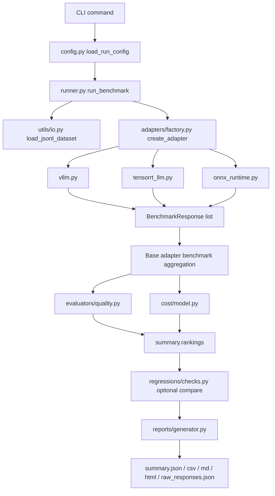

# LLM Evaluation & Benchmarking Suite

A reusable benchmarking harness for comparing `vLLM`, `TensorRT-LLM`, and `ONNX Runtime / ORT GenAI` across output quality, latency, throughput, reliability, and estimated serving cost.

This repository is designed to work in two practical modes:

- `mock mode`: runs locally without GPUs or live inference servers
- `real mode`: uses environment-specific endpoints, commands, or scripts for actual backend execution

The suite is organized so the same core workflow is used in both modes. Only the adapter implementation changes.

## Table Of Contents

- [What This Repository Is For](#what-this-repository-is-for)
- [How The Pieces Fit Together](#how-the-pieces-fit-together)
- [Execution Flow, End To End](#execution-flow-end-to-end)
- [Repository Map](#repository-map)
- [How Each Module Works](#how-each-module-works)
- [How Each Script Works](#how-each-script-works)
- [Profiles, Datasets, And Thresholds](#profiles-datasets-and-thresholds)
- [Step-By-Step Getting Started](#step-by-step-getting-started)
- [CLI Commands](#cli-commands)
- [Artifacts And Outputs](#artifacts-and-outputs)
- [How Mock Mode Works](#how-mock-mode-works)
- [How Real Mode Works](#how-real-mode-works)
- [Backend-Specific Notes](#backend-specific-notes)
- [Regression Comparison](#regression-comparison)
- [Testing And Validation](#testing-and-validation)
- [Docker Workflow](#docker-workflow)
- [Troubleshooting](#troubleshooting)
- [Current Limitations](#current-limitations)

## What This Repository Is For

Choosing an inference backend is a trade-off problem.

A backend can be faster but less accurate. A configuration can reduce cost while hurting TTFT. A quantized deployment can improve throughput but increase failures or quality drift. This suite gives you one repeatable path to answer those questions and to turn them into baseline and regression checks.

It is useful for:

- ML engineers validating answer quality across serving stacks
- platform engineers integrating internal inference systems into a common harness
- performance engineers tracking latency and throughput regressions over time
- CI pipelines that need a deterministic benchmark smoke path

## How The Pieces Fit Together

At a high level, the repository is a pipeline:

1. A CLI command starts the run.
2. A YAML profile is loaded.
3. Datasets are read from `jsonl` files.
4. Adapters are created for each selected backend.
5. Each adapter produces normalized `BenchmarkResponse` objects.
6. The runner aggregates serving metrics.
7. The evaluator computes quality metrics.
8. The cost model estimates serving cost.
9. Rankings are computed.
10. Optional regression checks compare the run against a baseline.
11. Reports are written to disk.

## Execution Flow, End To End



## Repository Map

```text
llm_suite/
|-- .github/workflows/          CI workflow definitions
|-- artifacts/                  Generated example and benchmark outputs
|-- configs/
|   |-- costs/                  Cost model assumptions
|   |-- profiles/               Benchmark run profiles
|   `-- thresholds/             Regression gate thresholds
|-- data/
|   |-- golden/                 Golden/regression-oriented datasets
|   `-- sample/                 Small built-in demo datasets
|-- docker/                     Compose file for containerized demo runs
|-- scripts/                    Helper scripts used by adapters or demos
|-- src/llm_benchmark_suite/    Main application code
|-- tests/                      Pytest coverage
|-- Dockerfile
|-- Makefile
|-- pyproject.toml
`-- README.md
```

## How Each Module Works

### `src/llm_benchmark_suite/cli.py`

This is the main entry point.

It provides the commands:

- `run`: execute a benchmark using a YAML profile
- `demo`: force mock mode and write to a chosen output directory
- `evaluate`: print quality metrics from an existing `summary.json`
- `report`: regenerate a specific report format from an existing summary
- `compare`: print regression comparison results
- `regress`: run regression gates and exit with code `1` if any fail
- `export-baseline`: copy a summary into a reusable baseline artifact

`cli.py` does very little business logic itself. Its job is to load config, call the orchestrator, and print results.

### `src/llm_benchmark_suite/config.py`

This module loads YAML profiles and turns them into a typed `RunConfig` model.

Responsibilities:

- reads profile YAML
- applies environment variable overrides for output directory and profile name
- validates the structure using Pydantic models

This is the boundary between repo configuration and runtime execution.

### `src/llm_benchmark_suite/orchestration/runner.py`

This is the core pipeline coordinator.

For each dataset and each selected backend it:

1. loads dataset requests
2. builds the adapter from the registry
3. starts the backend if needed
4. runs the benchmark via the adapter
5. evaluates quality
6. computes cost metrics
7. appends results into a `BenchmarkSummary`
8. computes rankings across the collected metrics
9. optionally compares the run with a baseline
10. writes reports and raw responses to disk

If `continue_on_error` is true, backend failures are recorded in `summary.metadata["errors"]` and the run continues.

### `src/llm_benchmark_suite/adapters/base.py`

This defines the common backend contract.

Important methods:

- `start_server()`: optional startup hook
- `stop_server()`: optional teardown hook
- `health_check()`: backend availability check
- `infer()`: one request in, one normalized response out
- `benchmark()`: runs `infer()` across a dataset and aggregates serving metrics

This is the reason the rest of the suite can stay backend-agnostic.

### `src/llm_benchmark_suite/adapters/factory.py`

This is the backend registry.

It maps backend names such as `vllm`, `tensorrt_llm`, and `onnx_runtime` to their adapter classes. Adding a new backend means implementing an adapter and registering it here.

### `src/llm_benchmark_suite/adapters/vllm.py`

The `vLLM` adapter supports:

- `mock` mode via deterministic fake responses
- `real` mode via an OpenAI-compatible HTTP endpoint

In real mode it:

- performs a health check against `health_endpoint` or `endpoint`
- sends a chat-completions style request
- extracts text and token usage from the JSON response

### `src/llm_benchmark_suite/adapters/tensorrt_llm.py`

The `TensorRT-LLM` adapter supports:

- `mock` mode via deterministic fake responses with slightly different latency characteristics
- `real` mode via a configured shell command

In real mode it expects the configured command to print JSON to stdout. The adapter reads that JSON and normalizes latency fields into a `BenchmarkResponse`.

### `src/llm_benchmark_suite/adapters/onnx_runtime.py`

The `ONNX Runtime` adapter supports:

- `mock` mode via deterministic fake responses with slightly adjusted timings
- `real` mode via a Python benchmark script

In real mode it executes the configured script and expects the script to print JSON to stdout.

### `src/llm_benchmark_suite/evaluators/quality.py`

This module compares model output against the dataset reference answers.

Metrics computed today:

- exact match
- token F1
- BLEU
- ROUGE-L
- pass rate
- golden pass rate

The output is stored as `AccuracyMetrics` for each backend and dataset pair.

### `src/llm_benchmark_suite/metrics/text.py`

This contains the lightweight text scoring functions used by the evaluator.

They are intentionally simple and dependency-light so the repository remains easy to run locally and in CI.

### `src/llm_benchmark_suite/cost/model.py`

This converts backend metrics into cost metrics using the selected cost profile.

Examples:

- cost per request
- cost per successful response
- cost per million tokens
- cost-adjusted quality score

### `src/llm_benchmark_suite/regressions/checks.py`

This compares the current run to a baseline and evaluates regression gates.

Current comparisons include:

- p95 latency
- TTFT
- throughput
- cost per million tokens
- error rate max threshold
- accuracy minimum threshold
- missing backend/dataset pair detection

The comparison now runs per `(backend_name, dataset_name)` pair rather than only the first item in each summary.

### `src/llm_benchmark_suite/reports/generator.py`

This writes the final output artifacts.

Supported report formats:

- `json`
- `csv`
- `markdown`
- `html`

The generator consumes a `BenchmarkSummary` and emits human-readable and machine-readable outputs.

### `src/llm_benchmark_suite/schemas/models.py`

This defines the main data contracts used across the project.

Important models:

- `BenchmarkRequest`
- `BenchmarkResponse`
- `BackendMetrics`
- `AccuracyMetrics`
- `CostMetrics`
- `RegressionCheckResult`
- `BenchmarkSummary`

### `src/llm_benchmark_suite/utils/io.py`

This contains the file and dataset helpers.

It is responsible for:

- ensuring output directories exist
- loading `jsonl` datasets into `BenchmarkRequest` objects
- writing JSON artifacts
- writing CSV artifacts

### `src/llm_benchmark_suite/utils/system.py`

This records run metadata for traceability.

It collects:

- Python version
- platform string
- processor name
- UTC timestamp
- current git commit, when available

### `src/llm_benchmark_suite/logging_utils.py`

This sets the root logger format and level.

Environment variables supported here:

- `LLM_BENCHMARK_LOG_LEVEL`
- `LLM_BENCHMARK_JSON_LOGS`

## How Each Script Works

### `scripts/run_onnx_benchmark.py`

Current role: scaffold for real ONNX Runtime integration.

What it does now:

- receives command-line arguments
- prints a JSON payload to stdout
- makes it clear that environment-specific ONNX logic should replace it

How it connects to the suite:

- `configs/profiles/gpu-dev.yaml` or another real profile points `onnx_runtime.benchmark_script` at this file
- `src/llm_benchmark_suite/adapters/onnx_runtime.py` executes the script
- the adapter reads stdout JSON and turns it into a normalized response

What you would typically customize:

- model/session initialization
- execution provider selection
- prompt submission
- measurement of TTFT and total latency
- structured stdout JSON fields consumed by the adapter

### `scripts/mock_tensorrt_runner.py`

Current role: demonstration helper for a command-driven TensorRT-LLM integration.

What it does now:

- prints static JSON with example latency and throughput fields
- shows the shape expected by a command-based benchmark wrapper

How it connects to the suite:

- a profile can point `tensorrt_llm.command` to `python scripts/mock_tensorrt_runner.py`
- `src/llm_benchmark_suite/adapters/tensorrt_llm.py` executes the command
- the adapter parses stdout JSON into the common response schema

Why it matters:

- many TensorRT-LLM environments are driven by local benchmark binaries or wrappers instead of an HTTP API
- this script documents that pattern in a minimal way

### `Makefile`

This is the thin convenience layer for local development.

Targets:

- `make install`: install the package and dev dependencies
- `make lint`: run Ruff
- `make test`: run pytest with coverage
- `make demo`: run `cli run` using `PROFILE`, defaulting to `configs/profiles/local-demo.yaml`
- `make smoke`: run `cli demo` and force the output directory to `artifacts/generated/demo`
- `make report`: generate an HTML report from `artifacts/sample_run/summary.json`
- `make baseline`: export a baseline from `artifacts/sample_run/summary.json`
- `make regress`: run regression checks against that baseline

Important distinction:

- `make demo` runs `benchmark-suite run` semantics using the selected profile
- `make smoke` runs the actual `demo` CLI command

## Profiles, Datasets, And Thresholds

### Profiles

Profiles live in `configs/profiles/`.

Included examples:

- `local-demo.yaml`: full mock-mode demo across three datasets and three backends
- `ci-smoke.yaml`: small mock-mode run intended for CI
- `gpu-dev.yaml`: real-mode development profile with local endpoints and scripts
- `perf-lab.yaml`: larger real-mode profile for performance testing

A profile controls:

- which backends run
- which datasets are loaded
- mock vs real mode
- model defaults
- output location
- report formats
- cost profile path
- thresholds profile path
- backend-specific overrides

### Datasets

Datasets live under `data/` and use JSON Lines format.

Each row must include:

- `id`
- `prompt`
- `task_type`

Optional but strongly recommended:

- `reference`
- `expected_contains`
- `tags`

Example row:

```json
{"id":"qa-1","prompt":"What planet is known as the Red Planet?","reference":"Mars","task_type":"qa"}
```

### Cost Profile

Cost assumptions live in `configs/costs/default.yaml`.

This file controls the pricing values used by the cost model. Adjust it to match your infrastructure economics.

### Thresholds Profile

Regression gates live in `configs/thresholds/default.yaml`.

These thresholds determine whether a new run is considered a regression compared with a baseline.

## Step-By-Step Getting Started

### Step 1: Clone The Repository

```bash
git clone <repo-url>
cd llm_suite
```

### Step 2: Create A Virtual Environment

Windows PowerShell:

```powershell
python -m venv .venv
.venv\Scripts\Activate.ps1
```

macOS or Linux:

```bash
python -m venv .venv
source .venv/bin/activate
```

### Step 3: Install Dependencies

```bash
make install
```

Equivalent manual commands:

```bash
python -m pip install --upgrade pip
python -m pip install -e .[dev]
```

### Step 4: Run The Test Suite First

```bash
make test
```

This verifies that the package, CLI, configs, and mock-path benchmark flow work on your machine.

### Step 5: Run The Built-In Mock Benchmark

Recommended command:

```bash
python -m llm_benchmark_suite.cli demo --output-dir artifacts/generated/first-run
```

Alternative convenience command:

```bash
make smoke
```

What happens during this step:

1. `cli.py` loads `configs/profiles/local-demo.yaml`
2. `demo` overrides the profile to force `mock_mode=true`
3. `runner.py` iterates through the configured datasets and backends
4. each adapter returns deterministic mock responses
5. quality, cost, ranking, and report artifacts are produced

### Step 6: Inspect The Output Artifacts

Look in the chosen output directory. You should see:

- `summary.json`
- `summary.csv`
- `summary.md`
- `summary.html`
- `raw_responses.json`

Suggested inspection order:

1. open `summary.html` for the fastest overview
2. inspect `summary.json` for the full machine-readable structure
3. inspect `raw_responses.json` to see per-request normalized outputs

### Step 7: Print Quality Metrics From The Summary

```bash
python -m llm_benchmark_suite.cli evaluate --input artifacts/generated/first-run/summary.json
```

Use this when you want a quick textual view of quality numbers without opening a report.

### Step 8: Export A Baseline

```bash
python -m llm_benchmark_suite.cli export-baseline --input artifacts/generated/first-run/summary.json --output artifacts/generated/first-run/baseline.json
```

Use a baseline when you want future runs to be judged against a known-good result.

### Step 9: Run A Regression Check

```bash
python -m llm_benchmark_suite.cli regress --current artifacts/generated/first-run/summary.json --baseline artifacts/generated/first-run/baseline.json --thresholds configs/thresholds/default.yaml
```

Expected behavior:

- if all checks pass, the command exits successfully
- if any check fails, the command exits with code `1`

This is the command you would normally wire into CI.

### Step 10: Regenerate A Specific Report Format

```bash
python -m llm_benchmark_suite.cli report --input artifacts/generated/first-run/summary.json --format html --output-dir reports/generated/first-run
```

Use this when a summary already exists and you only want to regenerate presentation artifacts.

### Step 11: Run A Profile-Driven Benchmark

```bash
python -m llm_benchmark_suite.cli run --config configs/profiles/local-demo.yaml
```

This command respects whatever is inside the profile, including output directory and report formats.

This is what `make demo` calls under the hood.

### Step 12: Move From Mock Mode To Real Mode

1. Start from `configs/profiles/gpu-dev.yaml`
2. update backend connection details
3. replace scaffold scripts or commands with environment-specific implementations
4. run `benchmark-suite run --config <your-profile>`
5. export a baseline once the results are trustworthy
6. enable `regress` in CI or scheduled jobs

## CLI Commands

### `benchmark-suite run`

Run a benchmark using a YAML profile.

Example:

```bash
benchmark-suite run --config configs/profiles/local-demo.yaml
```

Optional baseline comparison during the run:

```bash
benchmark-suite run --config configs/profiles/local-demo.yaml --baseline artifacts/generated/first-run/baseline.json
```

### `benchmark-suite demo`

Run the built-in mock workflow and explicitly choose the output directory.

Example:

```bash
benchmark-suite demo --output-dir artifacts/generated/demo
```

### `benchmark-suite evaluate`

Print per-backend, per-dataset quality metrics from an existing summary.

```bash
benchmark-suite evaluate --input artifacts/generated/first-run/summary.json
```

### `benchmark-suite report`

Generate one report format from an existing summary.

```bash
benchmark-suite report --input artifacts/generated/first-run/summary.json --format markdown --output-dir reports/generated/first-run
```

### `benchmark-suite compare`

Print detailed regression comparison results between two summaries.

```bash
benchmark-suite compare --current artifacts/generated/run-a/summary.json --baseline artifacts/generated/run-b/summary.json --thresholds configs/thresholds/default.yaml
```

### `benchmark-suite regress`

Run the same regression checks but fail the process if any check does not pass.

```bash
benchmark-suite regress --current artifacts/generated/run-a/summary.json --baseline artifacts/generated/run-b/summary.json --thresholds configs/thresholds/default.yaml
```

### `benchmark-suite export-baseline`

Create a reusable baseline file from a summary.

```bash
benchmark-suite export-baseline --input artifacts/generated/first-run/summary.json --output artifacts/generated/baselines/local-demo.json
```

## Artifacts And Outputs

### `summary.json`

The primary machine-readable artifact.

Contains:

- run metadata
- backend metrics
- accuracy metrics
- cost metrics
- regression results
- rankings
- environment information
- raw backend list and dataset list

This is the artifact that later commands such as `evaluate`, `report`, `compare`, and `regress` consume.

### `raw_responses.json`

Contains one normalized response object per request.

Useful for:

- debugging adapter output
- auditing generated answers
- analyzing failed or low-quality cases

### `summary.csv`

A flat table for spreadsheet-style review.

### `summary.md`

A lightweight human-readable report for pull requests or artifact uploads.

### `summary.html`

A static browser-friendly report for quick inspection.

## How Mock Mode Works

Mock mode is implemented in the base adapter and backend adapters.

Characteristics:

- deterministic text generation based on backend name and request ID
- synthetic latency and token metrics
- no dependency on actual servers, GPUs, or benchmark binaries
- useful for CI, CLI validation, and report development

Mock mode is the recommended first run because it exercises the full pipeline without infrastructure dependencies.

## How Real Mode Works

In real mode, the suite still follows the same pipeline but adapters stop generating synthetic responses and instead call backend-specific integration points.

Typical pattern:

1. the profile selects `mock_mode: false`
2. backend-specific overrides provide endpoints, commands, or script paths
3. the adapter runs a health check if implemented
4. the adapter executes one request at a time and normalizes the output
5. the rest of the suite stays unchanged

This means the quality, cost, ranking, and regression logic do not need to know whether the data came from HTTP, a local binary, or a Python script.

## Backend-Specific Notes

### vLLM

Expected integration style:

- OpenAI-compatible HTTP endpoint
- optional health endpoint
- JSON response with `choices` and optional `usage`

Best fit when your serving stack already exposes an HTTP API.

### TensorRT-LLM

Expected integration style:

- local benchmark command or wrapper script
- JSON printed to stdout

Best fit when your benchmarking environment is command-driven instead of service-driven.

### ONNX Runtime / ORT GenAI

Expected integration style:

- local Python script or wrapper
- JSON printed to stdout

Best fit when you want to run inference through a custom environment-specific script, especially when session setup or provider selection is specific to your deployment.

## Regression Comparison

Regression thresholds live in `configs/thresholds/default.yaml`.

Current checks include:

- `p95_latency`
- `ttft`
- `throughput`
- `cost_per_million_tokens`
- `error_rate`
- `accuracy_min`
- `missing_pair`

A regression comparison is performed per `(backend_name, dataset_name)` pair. That matters when one run contains more than one backend or more than one dataset, because each pair is evaluated independently.

Typical workflow:

1. generate a trusted summary
2. export it as a baseline
3. generate a new summary after a code, model, or infrastructure change
4. compare current vs baseline
5. fail CI if regression gates fail

## Testing And Validation

Run lint:

```bash
make lint
```

Run tests:

```bash
make test
```

Run the verified local workflow:

```bash
python -m pip install -e .[dev]
python -m ruff check src tests
python -m pytest
python -m llm_benchmark_suite.cli demo --output-dir artifacts/generated/verified-demo
python -m llm_benchmark_suite.cli report --input artifacts/generated/verified-demo/summary.json --format html --output-dir reports/generated/verified-demo
python -m llm_benchmark_suite.cli export-baseline --input artifacts/generated/verified-demo/summary.json --output artifacts/generated/verified-demo/baseline.json
python -m llm_benchmark_suite.cli regress --current artifacts/generated/verified-demo/summary.json --baseline artifacts/generated/verified-demo/baseline.json --thresholds configs/thresholds/default.yaml
```

## Docker Workflow

Build the image:

```bash
docker build -t llm-benchmark-suite .
```

Run the container directly:

```bash
docker run --rm -v ${PWD}/artifacts:/app/artifacts llm-benchmark-suite
```

Run via compose:

```bash
docker compose -f docker/docker-compose.yml up --build
```

Current compose behavior:

- builds the repo image
- mounts `artifacts/` and `reports/`
- runs `python -m llm_benchmark_suite.cli demo --output-dir artifacts/generated/compose-demo`

## Troubleshooting

### The CLI command is not found

Install the package in editable mode:

```bash
python -m pip install -e .[dev]
```

Or invoke commands as:

```bash
python -m llm_benchmark_suite.cli <command>
```

### `make demo` and `make smoke` behave differently

That is intentional.

- `make demo` calls `run` and uses the profile's configured output directory
- `make smoke` calls `demo` and requires an explicit output directory baked into the target

### The output directory is not where I expected

Check:

- `output_dir` in the selected profile
- whether you used `run` or `demo`
- whether `LLM_BENCHMARK_OUTPUT_DIR` is set in your environment

### Real-mode vLLM fails health checks

Verify:

- the configured endpoint is reachable
- `health_endpoint` is correct if you use a separate health route
- the server returns a non-5xx status code

### Real-mode TensorRT-LLM fails

Verify:

- the configured command exists on the machine
- running the command manually prints valid JSON
- the JSON contains the latency fields expected by the adapter

### Real-mode ONNX Runtime fails

Verify:

- the configured script path is correct
- the script can be run manually with Python
- the script prints valid JSON to stdout

### Regression checks fail unexpectedly

Inspect:

- the current and baseline `summary.json`
- whether a backend/dataset pair is missing in one run
- the thresholds in `configs/thresholds/default.yaml`

## Current Limitations

- concurrency is represented in config and metrics, but execution is still sequential
- mock mode is useful for validation, not for production-grade load testing
- real backend integrations are scaffolds and may require environment-specific extension
- text quality metrics are intentionally lightweight and not task-specialized
- HTML reporting is static and intentionally simple
- path validation and config validation are still fairly minimal

## Recommended First Session

If you want the shortest path to a successful run:

```bash
make install
make test
python -m llm_benchmark_suite.cli demo --output-dir artifacts/generated/first-run
python -m llm_benchmark_suite.cli evaluate --input artifacts/generated/first-run/summary.json
```

Then inspect:

- `artifacts/generated/first-run/summary.html`
- `artifacts/generated/first-run/summary.json`
- `artifacts/generated/first-run/raw_responses.json`
